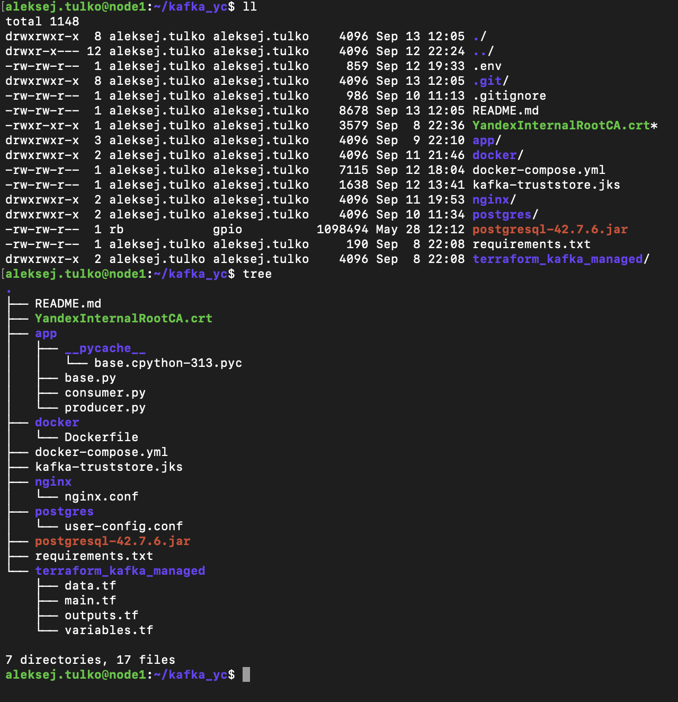

# Описание

kafka_yc - это кластер из 3-х Apache Nifi сервисов, координируемых сервисом Zookeeper. Apache Nifi  включает два процессора: один читает данных из топика в Managed Apache Kafka передает эти данные второму процессору, который преобразует данные из Avro и складывает в таблице в Postgres.

За генерацию и отправку данных в Managed Apache Kafka отвечает сервис *app_producer*. Помимо получения данных из Postgres, можно так же запустить *app_consumer*.

Сериализация и десериализация сообщений осуществляется с помощью Avro-схемы в Schema Registry (поднимается вместе с Managed Apache Kafka).

### Требования

- **OS**: Linux Ubuntu 24.04 aarm
- **Python**: Python 3.12.3
- **Docker**: 28.2.2 - https://docs.docker.com/engine/install/ubuntu/
- **Hashicorp Terraform**: https://yandex.cloud/ru/docs/tutorials/infrastructure-management/terraform-quickstart
- **Yandex Cloud CLI**: https://yandex.cloud/ru/docs/cli/quickstart#install


# Подготовка рабочей среды

1. Склонировать репозиторий и перейти в него:
```bash
cd ~
git clone https://github.com/aleksej-tulko/kafka_yc.git
cd kafka_yc
```

2. Создать файл с переменными окружения для сервисов в *docker-compose.yml*:
```bash
cat > .env <<'EOF'
BOOTSTRAP_SERVERS='<known_after_terraform>:9091,<known_after_terraform>:9091,<known_after_terraform>:9091'
TOPIC='test_topic'
DLQ='dead_letter_queue'

ACKS_LEVEL='all'
RETRIES=3
COMPRESSION_TYPE='lz4'
AUTOOFF_RESET='earliest'
ENABLE_AUTOCOMMIT=False
SESSION_TIME_MS=60000
FETCH_MIN_BYTES=1
FETCH_WAIT_MAX_MS=100

PRODUCER_USERNAME='test_producer'
CONSUMER_USERNAME='test_consumer'
SCHEMA_REGISTRY_WRITER_USERNAME='test_schema_writer'
SCHEMA_REGISTRY_READER_USERNAME='test_schema_reader'

PRODUCER_PASSWORD='producer_pass'
CONSUMER_PASSWORD='consumer_pass'
SCHEMA_REGISTRY_PASSWORD='schema_pass'

POSTGRES_USER='postgres-user'
POSTGRES_PASSWORD='postgres-pw'
POSTGRES_DB='postgres-db'

NIFI_USER='nifi-user'
NIFI_PASSWORD='nifi-password'
NIFI_SENSITIVE_PROPS_KEY='3e38a10eb5fb'

HOST_ADDR='localhost'
EOF
```

3. Создать файл с переменными для terraform:
```bash
cd terraform_kafka_managed

cat > terraform.tfvars <<'EOF'
kafka_version = "3.5"
brokers_count = 3
cluster_name = "kafka-cluster"
kafka_resource_preset_id = "b3-c1-m4"
kafka_disk_size = 10
zookeeper_resource_preset_id = "b3-c1-m4"
zookeeper_disk_size = 10
network_id = "<your_vpc_network>"
subnet_ids = [<list_of_your_subnets>]
kafka_topics = [{
  name               = "test_topic"
  partitions         = 3
  replication_factor = 3
  config = {
    cleanup_policy = "CLEANUP_POLICY_COMPACT"
    compression_type = "COMPRESSION_TYPE_LZ4"
    delete_retention_ms   = 1000 # хранит 1 секунду сообщения со значением null
    file_delete_delay_ms  = 10000 # если брокер уже запланировал удаление сегмента, он ждет еще 10 секунд
    flush_messages        = 100 # сброс на диск каждые 100 сообщений
    flush_ms              = 1000 # сброс на диск каждую секунду
    min_compaction_lag_ms = 6000
    retention_bytes       = 52428800 # 50 мб
    retention_ms          = 4000000 # полдня
    max_message_bytes     = 1000000 # 1 мб
    min_insync_replicas   = 2
    segment_bytes         = 5242880 # 5 мб
    preallocate           = false # deprecated, но нужна для модуля
  }
},
{
  name               = "dead_letter_queue"
  partitions         = 3
  replication_factor = 3
  config = {
    cleanup_policy = "CLEANUP_POLICY_COMPACT"
    compression_type = "COMPRESSION_TYPE_LZ4"
    delete_retention_ms   = 1000 # хранит 1 секунду сообщения со значением null
    file_delete_delay_ms  = 10000 # если брокер уже запланировал удаление сегмента, он ждет еще 10 секунд
    flush_messages        = 100 # сброс на диск каждые 100 сообщений
    flush_ms              = 1000 # сброс на диск каждую секунду
    min_compaction_lag_ms = 6000
    retention_bytes       = 52428800 # 50 мб
    retention_ms          = 4000000 # полдня
    max_message_bytes     = 1000000 # 1 мб
    min_insync_replicas   = 2
    segment_bytes         = 5242880 # 5 мб
    preallocate           = false # deprecated, но нужна для модуля
  }
}
]

kafka_users = [{
  name = "test_producer"
  password = "producer_pass"
  permissions = [{
    topic_name = "test_topic"
    role = "ACCESS_ROLE_TOPIC_PRODUCER"
    allow_hosts = ["*"]
    },
    {
    topic_name = "dead_letter_queue"
    role = "ACCESS_ROLE_TOPIC_PRODUCER"
    allow_hosts = ["*"]
    }
    ]
  },
  {
  name = "test_consumer"
  password = "consumer_pass"
  permissions = [{
    topic_name = "test_topic"
    role = "ACCESS_ROLE_TOPIC_CONSUMER"
    allow_hosts = ["*"]
    }]
  },
  {
  name = "test_schema_writer"
  password = "schema_pass"
  permissions = [{
    topic_name = "test_topic-*;dead_letter_queue-*"
    role = "ACCESS_ROLE_SCHEMA_WRITER"
    allow_hosts = ["*"]
    }]
  },
  {
  name = "test_schema_reader"
  password = "schema_pass"
  permissions = [{
    topic_name = "test_topic-*"
    role = "ACCESS_ROLE_SCHEMA_READER"
    allow_hosts = ["*"]
    }]
  }
]
EOF
```

4. Собрать truststore сертификатом от Yandex:
```bash
cd ~/kafka_yc
wget "https://storage.yandexcloud.net/cloud-certs/CA.pem" --output-document ./YandexInternalRootCA.crt
chmod 0655 ./YandexInternalRootCA.crt
keytool -importcert -alias kafka-broker -file YandexInternalRootCA.crt -keystore kafka-truststore.jks -storepass changeit -noprompt
sudo chown 1000:1000 kafka-truststore.jks
```

5. Скачать JDBC драйвер для Postgres:
```bash
wget https://jdbc.postgresql.org/download/postgresql-42.7.6.jar
sudo chown 1000:1000 postgresql-42.7.6.jar
```

Так должен выглядеть каталог для за



echo "test message" | kcat -P \
    -b rc1a-ucd9gdk8nnlkhgm6.mdb.yandexcloud.net:9091 \
    -t test_topic \
    -k key \
    -X security.protocol=SASL_SSL \
    -X sasl.mechanism=SCRAM-SHA-512 \
    -X sasl.username="test_producer" \
    -X sasl.password="producer_pass" \
    -X ssl.ca.location=/usr/local/share/ca-certificates/Yandex/YandexInternalRootCA.crt -Z


kcat -C \
         -b rc1a-hq1uite1apjk5rfr.mdb.yandexcloud.net:9091 \
         -t test_topic \
         -X security.protocol=SASL_SSL \
         -X sasl.mechanism=SCRAM-SHA-512 \
         -X sasl.username="test_consumer" \
         -X sasl.password="consumer_pass" \
         -X ssl.ca.location=/usr/local/share/ca-certificates/Yandex/YandexInternalRootCA.crt -Z -K:


BOOTSTRAP_SERVERS='rc1a-8absvvlg11e9di8v.mdb.yandexcloud.net:9091,rc1a-d02dt23g03vidig5.mdb.yandexcloud.net:9091,rc1a-gf0rumtpj5mk5a82.mdb.yandexcloud.net:9091'
TOPIC='test_topic'
DLQ='dead_letter_queue'

ACKS_LEVEL='all'
RETRIES=3
COMPRESSION_TYPE='lz4'
AUTOOFF_RESET='earliest'
ENABLE_AUTOCOMMIT=False
SESSION_TIME_MS=60000
FETCH_MIN_BYTES=1
FETCH_WAIT_MAX_MS=100

PRODUCER_USERNAME='test_producer'
CONSUMER_USERNAME='test_consumer'
SCHEMA_REGISTRY_WRITER_USERNAME='test_schema_writer'
SCHEMA_REGISTRY_READER_USERNAME='test_schema_reader'

PRODUCER_PASSWORD='producer_pass'

CONSUMER_PASSWORD='consumer_pass'
SCHEMA_REGISTRY_PASSWORD='schema_pass'

POSTGRES_USER='postgres-user'
POSTGRES_PASSWORD='postgres-pw'
POSTGRES_DB='postgres-db'

NIFI_USER='nifi-user'
NIFI_PASSWORD='nifi-pw'

sudo docker exec -it postgres psql -h 127.0.0.1 -U postgres-user -d postgres-db

CREATE TABLE test (
    id SERIAL PRIMARY KEY,
    name VARCHAR(100),
    info VARCHAR(100),
    order_date TIMESTAMP DEFAULT CURRENT_TIMESTAMP
);


keytool -importcert \
  -alias kafka-broker \
  -file YandexInternalRootCA.crt \
  -keystore kafka-truststore.jks \
  -storepass changeit \
  -noprompt


sudo keytool -import -alias root-ca -trustcacerts \
  -file root-ca.pem \
  -keystore nifi-cluster-truststore.jks \
  -storepass changeit -noprompt

sudo keytool -import -alias kafka-int-ca -trustcacerts \
  -file kafka-int-ca.pem \
  -keystore nifi-cluster-truststore.jks \
  -storepass changeit -noprompt