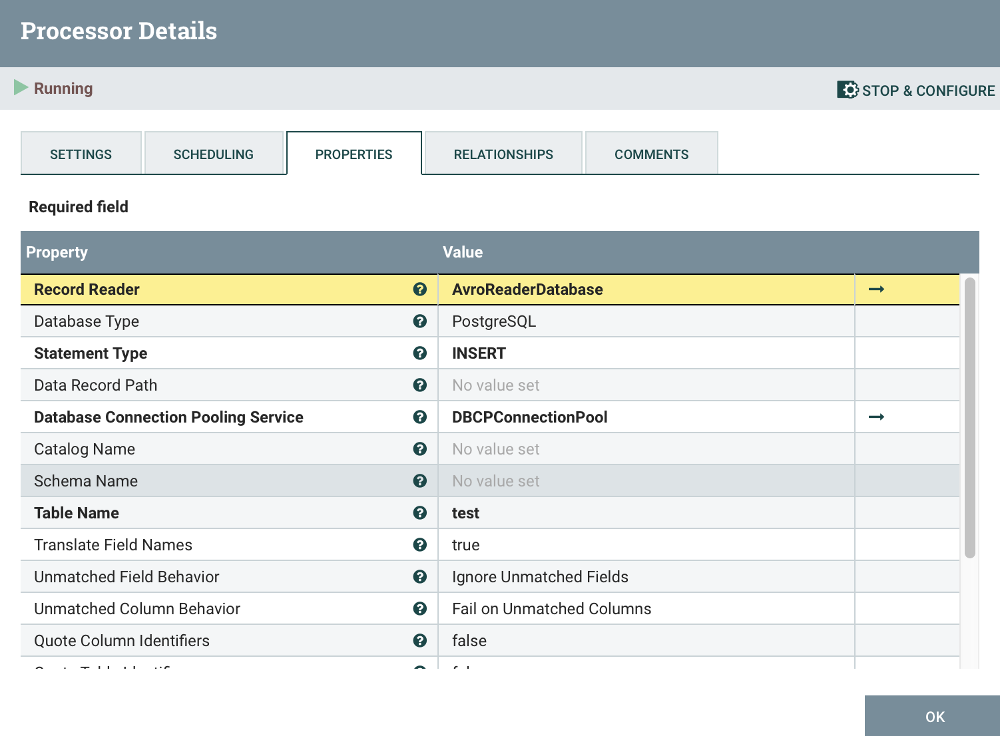
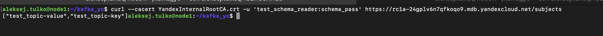

# Описание

kafka_yc - это кластер из 3-х Apache Nifi сервисов, координируемых сервисом Zookeeper. Apache Nifi  включает два процессора: один читает данных из топика в Managed Apache Kafka передает эти данные второму процессору, который преобразует данные из Avro и складывает в таблице в Postgres.

За генерацию и отправку данных в Managed Apache Kafka отвечает сервис *app_producer*. Помимо получения данных из Postgres, можно так же запустить *app_consumer*.

Сериализация и десериализация сообщений осуществляется с помощью Avro-схемы в Schema Registry (поднимается вместе с Managed Apache Kafka).

### Требования

- **OS**: Linux Ubuntu 24.04 aarm
- **Python**: Python 3.12.3
- **Docker**: 28.2.2 - https://docs.docker.com/engine/install/ubuntu/
- **Terraform**: https://yandex.cloud/ru/docs/tutorials/infrastructure-management/terraform-quickstart ### Terraforn от Hashicorp тоже сойдет, я таким и пользуюсь
- **Yandex Cloud CLI**: https://yandex.cloud/ru/docs/cli/quickstart#install


# Подготовка рабочей среды

1. Склонировать репозиторий и перейти в него:
```bash
cd ~
git clone https://github.com/aleksej-tulko/kafka_yc.git
cd kafka_yc
```

2. Создать файл с переменными окружения для сервисов в *docker-compose.yml*:
```bash
cat > .env <<'EOF'
BOOTSTRAP_SERVERS='<fqdn>:9091,<fqdn>:9091,<fqdn>:9091' ### Внимание! Сюда надо будет подставить FQDN брокеров Kafka, когда они будут известны после запуска terraform apply
TOPIC='test_topic'
DLQ='dead_letter_queue'

ACKS_LEVEL='all'
RETRIES=3
COMPRESSION_TYPE='lz4'
AUTOOFF_RESET='earliest'
ENABLE_AUTOCOMMIT=False
SESSION_TIME_MS=60000
FETCH_MIN_BYTES=1
FETCH_WAIT_MAX_MS=100

PRODUCER_USERNAME='test_producer'
CONSUMER_USERNAME='test_consumer'
SCHEMA_REGISTRY_WRITER_USERNAME='test_schema_writer'
SCHEMA_REGISTRY_READER_USERNAME='test_schema_reader'

PRODUCER_PASSWORD='producer_pass'
CONSUMER_PASSWORD='consumer_pass'
SCHEMA_REGISTRY_PASSWORD='schema_pass'

POSTGRES_USER='postgres-user'
POSTGRES_PASSWORD='postgres-pw'
POSTGRES_DB='postgres-db'

NIFI_USER='nifi-user'
NIFI_PASSWORD='nifi-password'
NIFI_SENSITIVE_PROPS_KEY='3e38a10eb5fb'

HOST_ADDR='<your_ip>' #### Внимание! Сюда надо будет подставить IP той ноды, где будет запущен кластер Nifi
EOF
```

3. Создать файл с переменными для terraform:
```bash
cd terraform_kafka_managed

cat > terraform.tfvars <<'EOF'
kafka_version = "3.5"
brokers_count = 3
cluster_name = "kafka-cluster"
kafka_resource_preset_id = "b3-c1-m4"
kafka_disk_size = 10
zookeeper_resource_preset_id = "b3-c1-m4"
zookeeper_disk_size = 10
network_id = "<your_vpc_network>" ### Внимание! Сюда надо будет подставить ID твоей vpc
subnet_ids = [<list_of_your_subnets>] ### Внимание! Сюда надо подставить сабнеты твоей vpc в виде строке
kafka_topics = [{
  name               = "test_topic"
  partitions         = 3
  replication_factor = 3
  config = {
    cleanup_policy = "CLEANUP_POLICY_COMPACT"
    compression_type = "COMPRESSION_TYPE_LZ4"
    delete_retention_ms   = 1000 # хранит 1 секунду сообщения со значением null
    file_delete_delay_ms  = 10000 # если брокер уже запланировал удаление сегмента, он ждет еще 10 секунд
    flush_messages        = 100 # сброс на диск каждые 100 сообщений
    flush_ms              = 1000 # сброс на диск каждую секунду
    min_compaction_lag_ms = 6000
    retention_bytes       = 52428800 # 50 мб
    retention_ms          = 4000000 # полдня
    max_message_bytes     = 1000000 # 1 мб
    min_insync_replicas   = 2
    segment_bytes         = 5242880 # 5 мб
    preallocate           = false # deprecated, но нужна для модуля
  }
},
{
  name               = "dead_letter_queue"
  partitions         = 3
  replication_factor = 3
  config = {
    cleanup_policy = "CLEANUP_POLICY_COMPACT"
    compression_type = "COMPRESSION_TYPE_LZ4"
    delete_retention_ms   = 1000 # хранит 1 секунду сообщения со значением null
    file_delete_delay_ms  = 10000 # если брокер уже запланировал удаление сегмента, он ждет еще 10 секунд
    flush_messages        = 100 # сброс на диск каждые 100 сообщений
    flush_ms              = 1000 # сброс на диск каждую секунду
    min_compaction_lag_ms = 6000
    retention_bytes       = 52428800 # 50 мб
    retention_ms          = 4000000 # полдня
    max_message_bytes     = 1000000 # 1 мб
    min_insync_replicas   = 2
    segment_bytes         = 5242880 # 5 мб
    preallocate           = false # deprecated, но нужна для модуля
  }
}
]

kafka_users = [{
  name = "test_producer"
  password = "producer_pass"
  permissions = [{
    topic_name = "test_topic"
    role = "ACCESS_ROLE_TOPIC_PRODUCER"
    allow_hosts = ["*"]
    },
    {
    topic_name = "dead_letter_queue"
    role = "ACCESS_ROLE_TOPIC_PRODUCER"
    allow_hosts = ["*"]
    }
    ]
  },
  {
  name = "test_consumer"
  password = "consumer_pass"
  permissions = [{
    topic_name = "test_topic"
    role = "ACCESS_ROLE_TOPIC_CONSUMER"
    allow_hosts = ["*"]
    }]
  },
  {
  name = "test_schema_writer"
  password = "schema_pass"
  permissions = [{
    topic_name = "test_topic-*;dead_letter_queue-*"
    role = "ACCESS_ROLE_SCHEMA_WRITER"
    allow_hosts = ["*"]
    }]
  },
  {
  name = "test_schema_reader"
  password = "schema_pass"
  permissions = [{
    topic_name = "test_topic-*"
    role = "ACCESS_ROLE_SCHEMA_READER"
    allow_hosts = ["*"]
    }]
  }
]
EOF
```

4. Собрать truststore сертификатом от Yandex:
```bash
cd ~/kafka_yc
wget "https://storage.yandexcloud.net/cloud-certs/CA.pem" --output-document ./YandexInternalRootCA.crt
chmod 0655 ./YandexInternalRootCA.crt
keytool -importcert -alias kafka-broker -file YandexInternalRootCA.crt -keystore kafka-truststore.jks -storepass changeit -noprompt
```

5. Скачать JDBC драйвер для Postgres:
```bash
wget https://jdbc.postgresql.org/download/postgresql-42.7.6.jar
sudo chown 1000:1000 postgresql-42.7.6.jar
```

Так должен выглядеть каталог перед запуском на ноде, где будут запускаться сервисы из *docker-compose.yml*:


6. Спуллить и сбилдать все образы:
```bash
sudo docker compose pull
sudo docker compose build
```

6. Запустить сервис с Postgres и создать таблицу:
```bash
sudo docker compose up postgres -d
sudo docker compose exec -it postgres psql -h 127.0.0.1 -U postgres-user -d postgres-db

CREATE TABLE test (
    id SERIAL PRIMARY KEY,
    name VARCHAR(100),
    info VARCHAR(100),
    order_date TIMESTAMP DEFAULT CURRENT_TIMESTAMP
);
```

7. Запустить *Apache Nifi* кластер:
```bash
sudo docker compose up zookeeper nifi-toolkit nifi-1 nifi-2 nifi-3 proxy -d
```

8. Дождаться, пока кластер будет готов (довольно долго выполняет *Expanding 128 NAR files with all processors...*, хотя возможно мой raspberry просто слабоват и на нормальной ноде будет быстро), и аутентфицироваться в браузере по адресу *https://your_ip:8443* с NIFI_USER
NIFI_PASSWORD из файла **.env**

9. Настроить процессор, который будет получить сообщения в формате Avro и складывать в Postgres:

    - Добавить *PutDatabaseRecord* процессор
    - Настроить его как на скринах:

    
    

    - Настроить контроллер *AvroReaderDatabase* как на скрине:

    

    - Настроить контроллер *DBCPConnectionPool* как показано на скрине (*Database User* и *Password* взять из **.env**)

    

10. Инициализировать terraform:
```bash
cd ~/kafka_yc/terraform_kafka_managed
export YC_TOKEN=$(yc iam create-token)
export YC_CLOUD_ID=$(yc config get cloud-id)
export YC_FOLDER_ID=$(yc config get folder-id)
terraform init
```

# Запуск Managed Apache Kafka и отправка сообщений

1. Запуск terraform:
```bash
cd ~/kafka_yc/terraform_kafka_managed
terraform apply
```

2. Забрать FQDN, которые после выполнения terraform отдал вывод и записать их в BOOTSTRAP_SERVER в **.env**:


3. Запуск продюсера:
```bash
cd ~/kafka_yc
sudo docker compose up app_producer -d
```

4. Конфигурация процессера в Apache Nifi, который будет читать созданный с помощью terraform топик и передавать сообщения в процессор, который будет складывать их в Postgres:

    - Вернуться к *https://your_ip:8443* в браузере и создать новый процессор ConsumeKafkaRecord_2_0

     В Kafka Brokers подставить значение переменной BOOTSTRAP_SERVER из пункта 2. В Topic Name(s) подставить значение переменной TOPIC из **.env**
     В поля Username и Password вставить значения переменных CONSUMER_USERNAME и CONSUMER_PASSWORD из **.env**
    - Сконфигурировать контроллеры как на скринах:

    *AvroReaderTest*
    

    *AvroRecordSetWriter*
    

    *ConfluentSchemaRegistry*
    В поле **Schema Registry URLs** подставить те же FQDN,
    что и в переменной BOOTSTRAP_SERVER из пункта 2, но без порта 9091 и с протоколом *https*. Например, https://rc1a-24gplv6n7qfkoqo9.mdb.yandexcloud.net
    

    *StabdardRestrictedSSLContextService*
    В поле Truststore Password подставить пароль *changeit*, с которым создавали трастстор ранее.
    

  По итогу должен быть такой набор контроллеров
   и такой набор процессоров 

5. Зайти в Postgres и проверить, что там появились записи:
```bash
sudo docker compose exec -it postgres psql -h 127.0.0.1 -U postgres-user -d postgres-db

SELECT * FROM test;
```

6. Запустить *app_consumer* (там должны выводиться те же записи, что и в Postgres):
```bash
sudo docker compose up app_consumer
```

# Скриншоты и схемы

Скриншот ответа вызова curl http://localhost:8081/subjects и curl -X GET http://localhost:8081/subjects/<название_схемы>/versions:



Файл схемы (.avsc или .json).
```json
{"id":1,"schema":"{\"fields\":[{\"name\":\"name\",\"type\":\"string\"},{\"name\":\"info\",\"type\":\"string\"}],\"name\":\"value\",\"namespace\":\"avro_test\",\"type\":\"record\"}","subject":"test_topic-value","version":1}
```

Подтверждение успешной передачи сообщений

Подтверждение успешного получения сообщений в *app_consumer*

Подтверждение успешного получения сообщений в БД

## Автор
[Aliaksei Tulko](https://github.com/aleksej-tulko)